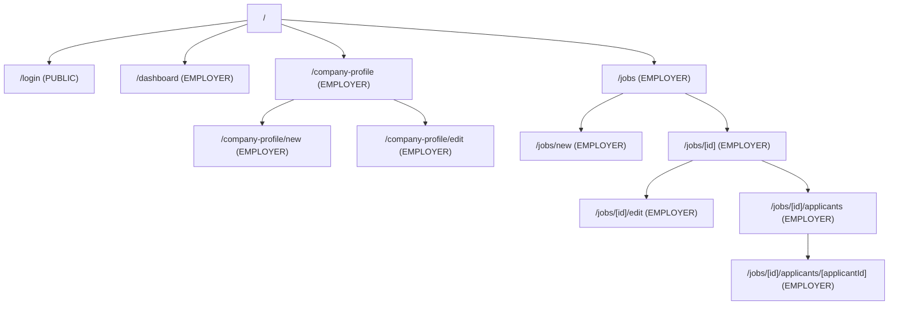

# Information Architecture Map

This document defines the complete route hierarchy for the Employer-facing dashboard, 
showing access levels and nested relationships.

## Route Hierarchy Diagram



## Access Level Legend

- **PUBLIC**: Accessible to all users (unauthenticated)
- **EMPLOYER**: Requires authentication and EMPLOYER role

## Route Nesting Structure

```
/
├── login (PUBLIC)
└── authenticated routes (EMPLOYER-only)
    ├── dashboard
    ├── company-profile/
    │   ├── (view profile)
    │   ├── new
    │   └── edit
    └── jobs/
        ├── (list all jobs)
        ├── new
        └── [id]/
            ├── (job detail view)
            ├── edit
            └── applicants/
                ├── (list applicants)
                └── [applicantId] (applicant detail)
```

## Notes

- All routes except `/login` require EMPLOYER authentication via AWS Amplify Auth
- Dynamic routes use Next.js bracket notation: `[id]`, `[applicantId]`
- Company profile creation (`/new`) is only shown if no profile exists
- Job and applicant management follows standard CRUD patterns
