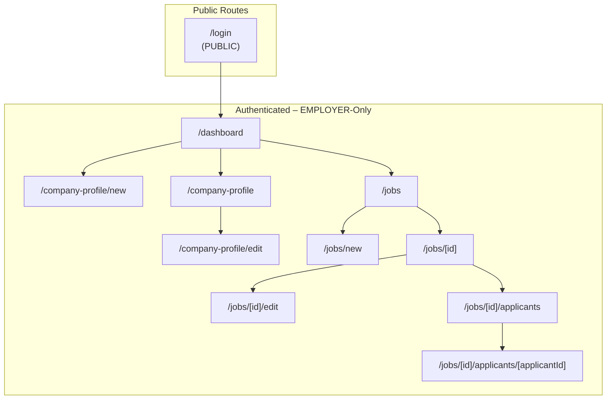

# Information Architecture Map - Employer Frontend

## Route Hierarchy and Access Levels

## Route Definitions and Explanations

### Public Routes

**`/login`** - Authentication entry point using AWS Amplify Auth UI. Handles both sign-in and sign-up flows for employers. Redirects authenticated EMPLOYER users to `/dashboard`. This is the only route accessible without authentication and serves as the gateway to the employer dashboard.

### Protected Routes (EMPLOYER Role Required)

**`/dashboard`** - Main landing page for authenticated employers. Provides overview of company status, recent job postings, and applicant activity metrics. Serves as the primary navigation hub with quick access to company profile management and job listing features. Shows summary cards for active jobs, pending applicants, and company profile completion status.

**`/company-profile/new`** - Company profile creation form for first-time employer setup. Only accessible when no company profile exists for the authenticated employer. Includes required fields for company information, description, industry, location, and contact details necessary for publishing job postings. Features form validation and guided setup flow.

**`/company-profile`** - Read-only view of the current company profile. Displays all company information including description, contact details, and branding that will be visible to job applicants. Provides navigation to edit mode and shows profile completion status. Acts as the employer's public-facing company page preview.

**`/company-profile/edit`** - Edit form for existing company profile. Allows modification of company details, description, industry classification, location, and contact information. Includes field validation, auto-save functionality, and preview mode. Changes are immediately reflected in job postings and applicant-facing views.

**`/jobs`** - Master list of all job postings created by the employer. Features filtering by status (active/inactive/draft), sorting by date created/modified, and search functionality by job title or keywords. Shows job status indicators, applicant counts, and quick action buttons. Primary navigation point for all job management activities.

**`/jobs/new`** - Comprehensive job creation form with fields for title, description, requirements, qualifications, salary range, employment type, and posting settings. Includes rich text editor for job descriptions, draft save functionality, and validation before publishing. Features template options and job posting preview.

**`/jobs/[id]`** - Detailed view of a specific job posting showing all job information, current status (active/inactive), application statistics, and applicant summary. Provides navigation to edit job details or view applicants. Includes job performance metrics and quick actions for job management.

**`/jobs/[id]/edit`** - Edit form for existing job postings. Allows modification of all job details while preserving existing applicant data and application history. Includes options to activate/deactivate postings, update requirements, and modify application deadlines. Changes are tracked with version history.

**`/jobs/[id]/applicants`** - Comprehensive list view of all applicants for a specific job. Shows applicant status progression through the hiring pipeline (NEW → REVIEW → HIRED/REJECTED), application dates, and candidate summary information. Features filtering by status, sorting by application date, and bulk action capabilities for status updates.

**`/jobs/[id]/applicants/[applicantId]`** - Detailed applicant profile and status management interface. Displays full application details, resume/portfolio attachments, cover letter, and application responses. Enables moving applicants through the hiring pipeline with status change controls, interview scheduling, notes, and feedback. Includes communication history and decision tracking.

## Navigation Flow and User Experience

The application follows a hierarchical navigation pattern optimized for employer workflow:

- **Dashboard Hub**: Central starting point with overview and quick navigation
- **Company Management**: Profile setup and maintenance accessible from dashboard
- **Job Lifecycle**: Linear flow from job creation → management → applicant review
- **Applicant Pipeline**: Structured progression through hiring stages with detailed tracking
- **Breadcrumb Navigation**: Consistent navigation context across all nested routes
- **Authentication State**: Preserved across all protected routes with automatic session management

## Technical Implementation Notes

- All routes except `/login` require EMPLOYER authentication via AWS Amplify Auth
- Dynamic routes use Next.js App Router bracket notation: `[id]`, `[applicantId]`
- Company profile creation flow is conditionally shown based on existing profile status
- Job and applicant management follows RESTful CRUD patterns with real-time updates
- Authentication is handled by AWS Cognito with EMPLOYER group membership validation
- Route protection implemented at the layout level with role-based access control
