# Information Architecture Map

This document defines the complete route hierarchy for the Employer-facing dashboard, 
showing access levels and nested relationships.

## Route Hierarchy Diagram

```mermaid
flowchart TB
  subgraph Public [Public Routes]
    login["/login\n(PUBLIC)"]
  end

  subgraph Protected [Authenticated – EMPLOYER-Only Routes]
    dashboard["/dashboard"]
    companyProfile["/company-profile"]
    companyNew["/company-profile/new"]
    companyEdit["/company-profile/edit"]
    jobsSection["/jobs"]
    newJob["/jobs/new"]
    jobDetail["/jobs/[id]"]
    editJob["/jobs/[id]/edit"]
    applicantsList["/jobs/[id]/applicants"]
    applicantProfile["/jobs/[id]/applicants/[applicantId]"]

    dashboard --> companyProfile
    dashboard --> jobsSection
    companyProfile --> companyNew
    companyProfile --> companyEdit
    jobsSection --> newJob
    jobsSection --> jobDetail
    jobDetail --> editJob
    jobDetail --> applicantsList
    applicantsList --> applicantProfile
  end

  login --> dashboard
```

## Route Details

| Route Path | Access Level | Purpose |
|------------|--------------|---------|
| `/login` | PUBLIC | Login page using Amplify Auth UI. |
| `/dashboard` | EMPLOYER-only | Main dashboard after login; shows overview and nav. |
| `/company-profile/new` | EMPLOYER-only | Create company profile (if one doesn't exist). |
| `/company-profile` | EMPLOYER-only | View company profile details. |
| `/company-profile/edit` | EMPLOYER-only | Edit existing company profile. |
| `/jobs` | EMPLOYER-only | List all job postings by the employer. |
| `/jobs/new` | EMPLOYER-only | Create a new job listing. |
| `/jobs/[id]` | EMPLOYER-only | View details for a specific job. |
| `/jobs/[id]/edit` | EMPLOYER-only | Edit a specific job listing. |
| `/jobs/[id]/applicants` | EMPLOYER-only | View all applicants for a job. |
| `/jobs/[id]/applicants/[applicantId]` | EMPLOYER-only | View and update applicant status. |

## Access Control Notes

- All routes except `/login` require EMPLOYER authentication via AWS Amplify Auth
- Dynamic routes use Next.js bracket notation: `[id]`, `[applicantId]`
- Company profile creation (`/new`) is only shown if no profile exists
- Job and applicant management follows standard CRUD patterns
- Authentication is handled by AWS Cognito with EMPLOYER group membership
